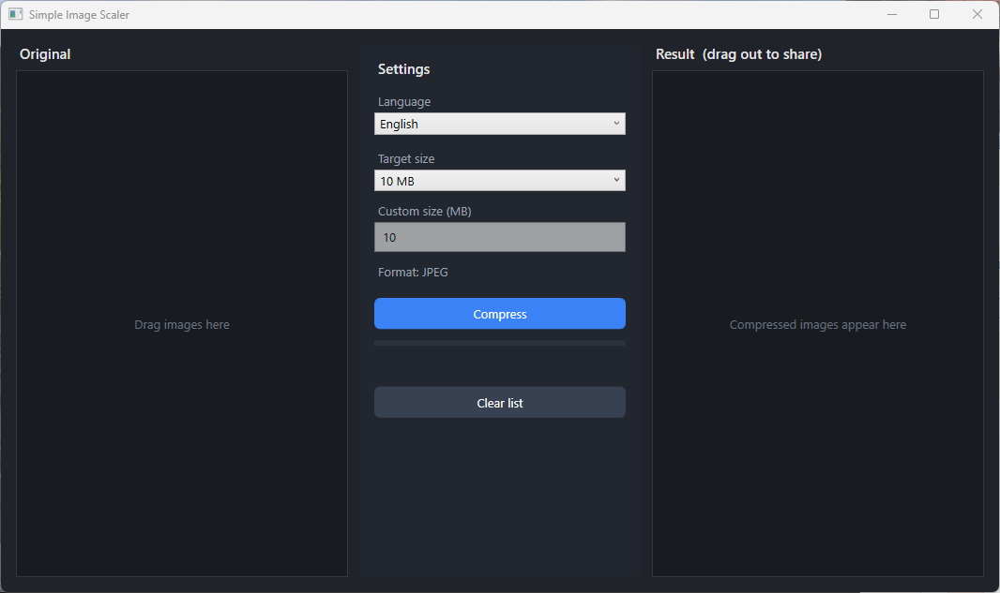

# Simple Image Scaler

A lightweight Windows tool that **compresses images down to a target file size** (e.g. 10 MB) — perfect for getting photos under an upload limit (Discord, email, the web) in seconds.

Three columns, just like a file manager: drag your originals in on the left, pick a target size in the middle, drag the finished images out on the right. The results are temporary and are cleaned up automatically when you close the app.

Available in **English and German** (English by default — switch any time in the settings).



> ⚠️ **Windows only.** Simple Image Scaler is a WPF app and runs on Windows (x64) only.

---

## Features

- 🎯 **Target size per image** – fixed presets (8 / 10 / 25 / 50 MB) or your own value in MB
- 🔍 **Best quality for the size** – resolution is preserved; only the JPEG quality is tuned via binary search to the highest value that still fits under the target
- 🖱️ **Drag & drop in and out** – drag images into the left list, drag the finished ones straight into Discord, a folder, or an email
- 🌍 **Bilingual UI** – English and German, switchable at runtime
- 🧹 **Automatic cleanup** – compressed images are temporary and deleted on exit (orphaned files from a crash are removed on the next start)
- 🟠 **Clear feedback** – each image shows its quality and new size; targets that can't be met are marked orange, errors red
- 📦 **No installation** – a single `.exe` with the runtime bundled in

---

## Usage

1. **Drag images in** – Drag one or more images from Explorer into the **left** column ("Original"). Supported: `.jpg`, `.jpeg`, `.png`, `.bmp`, `.webp`, `.gif`. Other files are ignored.
2. **Pick a target size** – In the **middle**, choose a preset (8 / 10 / 25 / 50 MB), or select `Custom…` and type a value in MB.
3. **Compress** – Click **Compress**. The progress bar runs and the results appear on the right as JPEGs with their new size and quality info.
4. **Drag out** – In the **right** column, select one or more images and drag them wherever you need them (a Discord chat, a folder, an email …).
5. **Close** – When you exit, the temporary results are deleted automatically. Anything you already dragged out is kept, of course.

> 💡 The output format is always **JPEG**, because it lets the target size be hit most precisely and opens everywhere. (PNG transparency is lost in the process.)

> 🌐 Use the **Language** dropdown at the top of the settings column to switch between English and German.

---

## Download & run

1. Download the latest `Simple Image Scaler.exe` from the [Releases](../../releases).
2. Double-click — that's it. No installation required.

On first launch **Windows SmartScreen** may warn ("Unknown publisher") because the `.exe` is not code-signed. Click **More info → Run anyway** to start it.

---

## Build from source

**Requirements:** [.NET SDK 11](https://dotnet.microsoft.com/download) (or newer), Windows x64.

```bash
# Clone the repository
git clone https://github.com/<your-user>/simple-image-scaler.git
cd simple-image-scaler

# Run the tests
dotnet test

# Run in debug mode
dotnet run --project src/ImageScaler
```

### Produce a standalone .exe

```bash
dotnet publish src/ImageScaler/ImageScaler.csproj -c Release -r win-x64 --self-contained true -p:PublishSingleFile=true -p:IncludeNativeLibrariesForSelfExtract=true -p:EnableCompressionInSingleFile=true -o publish_out
```

The resulting `Simple Image Scaler.exe` will be in the `publish_out` folder (~68 MB, since the .NET runtime and SkiaSharp are bundled in).

---

## Project structure

```
src/
  ImageScaler.Core/     # UI-free compression logic (JpegCompressor, TempSession)
  ImageScaler/          # WPF app (3-column UI, drag & drop, localization)
tests/
  ImageScaler.Tests/    # Unit tests for the core logic
docs/plans/             # Design and implementation documents
```

---

## How it works

- **[.NET 11](https://dotnet.microsoft.com/) / WPF** – desktop UI
- **[SkiaSharp](https://github.com/mono/SkiaSharp)** (MIT) – image encoding
- **xUnit** – tests

Compression loads the image and repeatedly encodes it in memory at different JPEG quality levels (5–95) using a binary search, then picks the highest quality whose file still fits under the target size. If the image is already smaller than the target it is saved at maximum quality; if the target can't be reached even at minimum quality, the image is still produced and flagged.

---

## License

Released under the [PolyForm Noncommercial License 1.0.0](LICENSE).

You are free to use, modify, and share this software **for any noncommercial purpose** (personal use, hobby projects, education, charities, etc.). **Commercial use — including selling it — is not permitted** without a separate license from the author. For commercial licensing, please get in touch.

The bundled SkiaSharp library is MIT-licensed.
